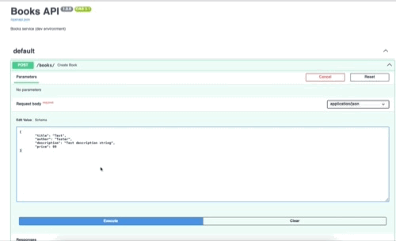

# Instructions for setup

**Required dependencies** 
[Docker](https://docs.docker.com/engine/install/)
[Docker Desktop](https://www.docker.com/products/docker-desktop/)
[python](https://www.python.org/downloads/)
[helm](https://helm.sh/docs/intro/install/)
[Minikube](https://minikube.sigs.k8s.io/docs/start/)
[Kubernetes](https://kind.sigs.k8s.io/)

**Install Dependencies** 
```Bash
python3 -m venv venv
```
```Bash
source venv/bin/activate
```

**Note the below is needed for local running**
Install pip for python then install the below
[pip for python](https://packaging.python.org/en/latest/tutorials/installing-packages/)
*Then you can run the below in order*
```Bash
pip install flask-sqlalchemy
```
```Bash
pip install uvicorn
```
```Bash
pip install fastapi
```

# ▶️ Run Locally
```Bash
uvicorn main:app --host 0.0.0.0 --port 8080 --reload
```

# 🐳 Docker
**Build & Run**
```Bash
docker build -t bookstore-api .
```
```Bash
docker run -p 8080:8080 bookstore-api
```

**If using Docker Compose**
In terminal run the following
```Bash
docker compose up --build
```

# 🚀 GitHub Actions CI/CD
Every push to **main** triggers:

    Build Docker image

    Push to GitHub Container Registry (GHCR)
Image URL:
```Bash
ghcr.io/gabrielpora/docker-pipeline-demo:latest
```
**Pull GHCR Image:**
```Bash
docker pull ghcr.io/gabrielpora/docker-pipeline-demo:latest
```
**Run the image**
```Bash
docker run -d -p 8080:8080 ghcr.io/gabrielpora/docker-pipeline-demo:latest
```

**🧪 Test image locally**
```Bash
docker run -it --rm -p 8080:8080 ghcr.io/gabrielpora/docker-pipeline-demo:latest
```

Workflow:  [.github/workflows/docker-image.yml](.github/workflows/docker-image.yml)


# ☸️ Helm (Kubernetes Deployment, Minikube or Kubernetes)
📁 Helm Chart Structure

Located in: helm/bookstore-api/

Includes:

    Deployment.yaml

    Service.yaml

    Ingress.yaml

    ConfigMap.yaml

    values.yaml

## Option 1: Minikube:
**▶️ Run using Minikube**
Start a Local Cluster 
```Bash
minikube start
```

**📁Install Helm Chart**
```Bash
helm install bookstore-api ./helm/bookstore-api \
  --set image.repository=ghcr.io/gabrielpora/docker-pipeline-demo \
  --set image.tag=latest
```

**🧼 Best practice: Clean Up Old Releases**
```Bash
helm uninstall bookstore-api
```

**Check Pods and Services**
```Bash
kubectl get pods
```
```Bash
kubectl get svc
```

**🌐 Access the API (via Port Forwarding or Ingress)**
**Option 1: Port Forwarding**
```Bash
kubectl port-forward svc/bookstore-api 8080:8080
```
Now visit: http://localhost:8080/docs

**Option 2: Ingress (Optional Setup)**
If your cluster supports ingress (like Minikube with ingress addon):
```Bash
minikube addons enable ingress
```

**Override environment**
```Bash
helm install bookstore-api ./helm/bookstore-api \
  --values env/dev.yaml
```


**Package the chart**
```Bash
helm package helm/bookstore-api
```

**Deploy to a cluster**
```Bash
helm upgrade --install bookstore-api ./bookstore-api-1.0.0.tgz \
  --namespace bookstore --create-namespace
```


# ⚙️ Configuration 
**Bookstore API Config**


| Variable          | Default                                  | Description                                                      |
|-------------------|------------------------------------------|------------------------------------------------------------------|
| `DATABASE_URL`    | `sqlite:///./books.db`                   | SQLAlchemy database connection string.                           |
| `LOG_LEVEL`       | `INFO`                                   | Root logger level (e.g. DEBUG, INFO, WARNING).                  |
| `LOG_FORMAT`      | `%(levelname)s:%(name)s:%(message)s`     | Python `logging` format string.                                  |
| `PAGE_SIZE`       | `10`                                     | Number of items per page on the `/books/` endpoint.             |
| `APP_ENV`         | `dev`                                    | App environment label (e.g. dev / staging / prod).              |
| `HOST`            | `0.0.0.0`                                | Uvicorn host binding.                                           |
| `PORT`            | `8080`                                   | Uvicorn port.                                                   |
| `RELOAD`          | `False`                                  | Whether Uvicorn runs in reload mode (`True`/`False`).           |
| `ALLOWED_ORIGINS` | `*`                                      | Comma-separated list for CORS allowed origins (`*` = all).      |
| `DB_POOL_SIZE`    | `5`                                      | SQLAlchemy connection-pool size.                                |
| `DB_MAX_OVERFLOW` | `10`                                     | SQLAlchemy max overflow connections beyond the pool size.       |


## Visit the API once everything running
Open your browser and go to:
    Swagger Docs: http://localhost:8080/docs
    Redoc: http://localhost:8080/redoc

**Note:** 
I have added a testExample.json file for you to load a test book when going to the Swagger docs. Paste it in the Create section




📬 Contact
[Gabriel Groener](https://github.com/GabrielPora)
For feedback, reach out or open an issue.
